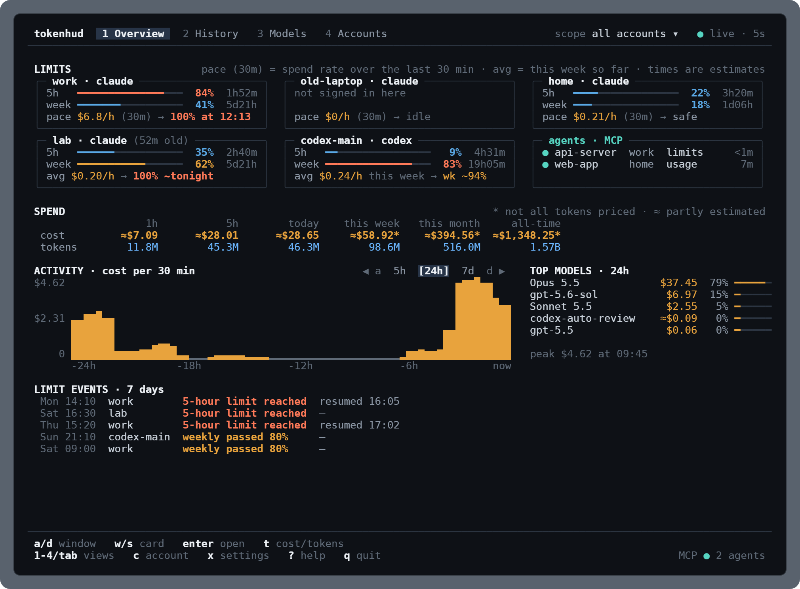
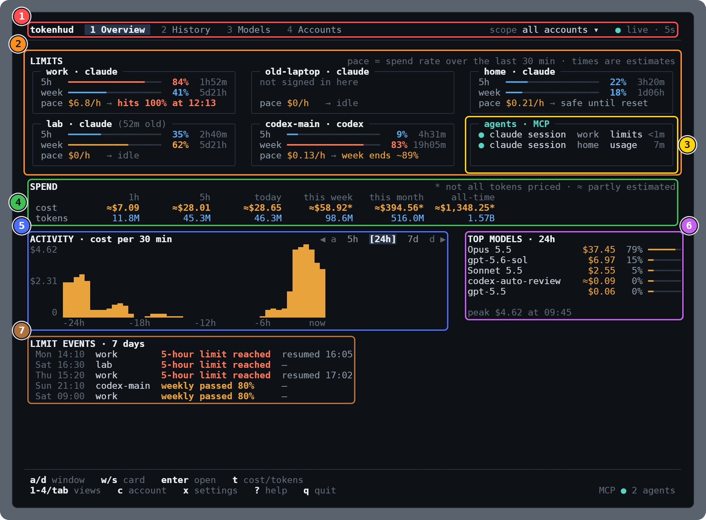
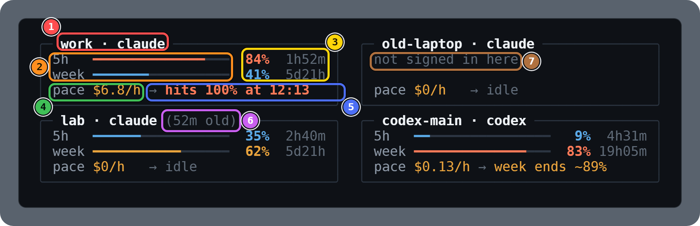
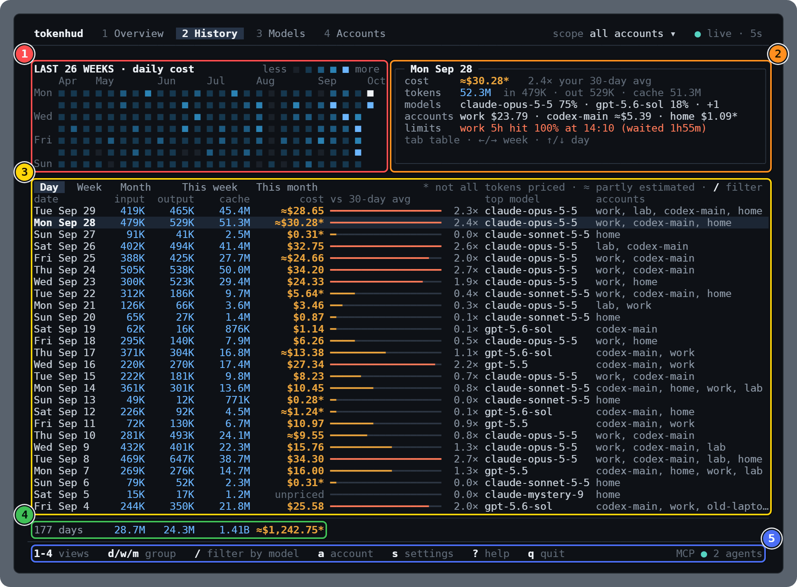
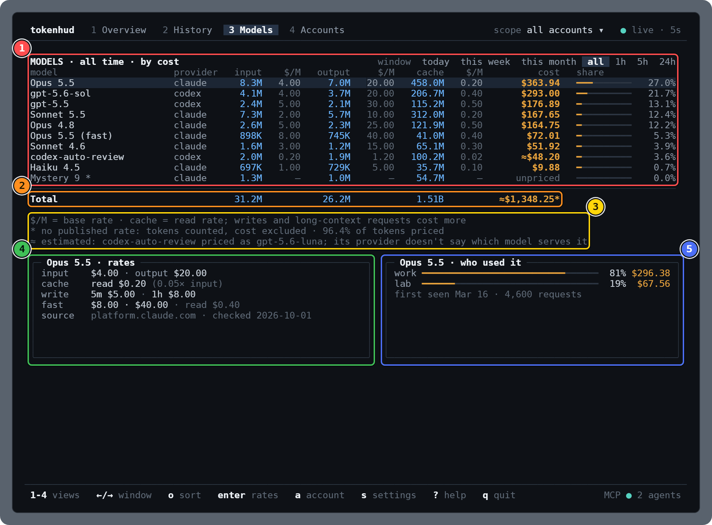
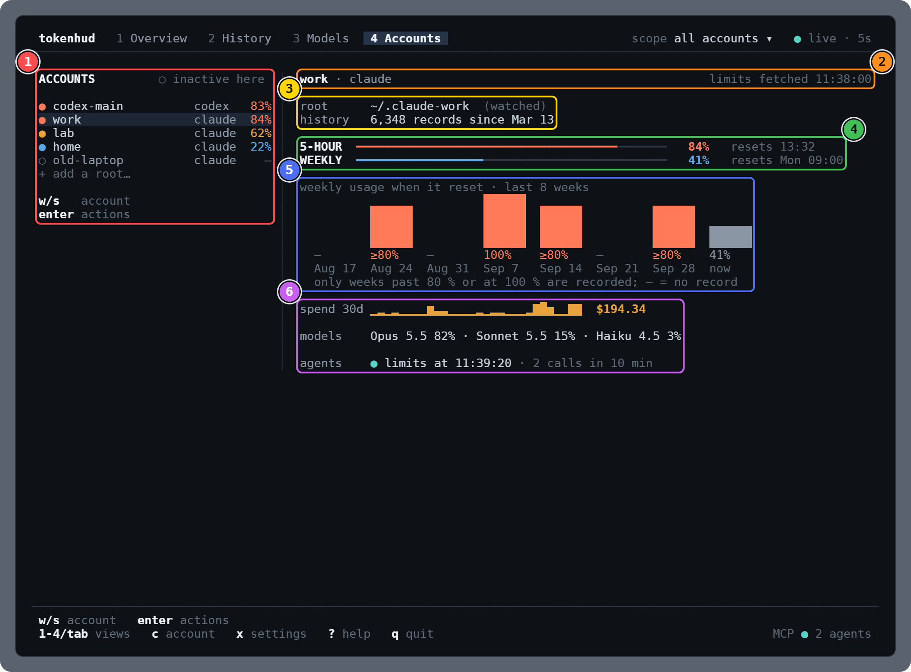

# tokenhud

tokenhud is a terminal dashboard for your coding-agent usage. It reads the transcripts that
Claude Code and Codex write on your machine and shows, for every account, how close you are
to your subscription limits, what your usage would cost at API prices, and where it went:
by day, by model and by account. It keeps that history after the transcripts are deleted.
It also runs an MCP server, so a Claude Code agent can check its own account's limits and
wait for a reset instead of failing halfway through a task.

tokenhud succeeds [cc-usage](https://github.com/ZhuoQiuMcgill/cc-usage) and imports its
history on first run.



<sub>The Overview on made-up accounts. [Views](#views) explains every part of every screen.</sub>

## Install

**Linux and macOS:**

```sh
curl -fsSL https://raw.githubusercontent.com/ZhuoQiuMcgill/tokenhud/main/install.sh | sh
```

**Windows** (PowerShell):

```powershell
irm https://raw.githubusercontent.com/ZhuoQiuMcgill/tokenhud/main/install.ps1 | iex
```

Both download the binary for your machine from
[GitHub Releases](https://github.com/ZhuoQiuMcgill/tokenhud/releases), check its SHA-256
against the release's `SHA256SUMS`, and install it without sudo or admin rights:
`install.sh` to `~/.local/bin/tokenhud` (it tells you if that isn't on your PATH),
`install.ps1` to `%LOCALAPPDATA%\tokenhud\bin\tokenhud.exe`, which it adds to your user
PATH. Running either again reinstalls, or updates to the newest release.

| Variable | Effect |
|---|---|
| `TOKENHUD_VERSION` | Install this release, e.g. `0.1.0` or `0.1.0-rc.1`. Default: the latest stable release; until there is one, name a release candidate here |
| `TOKENHUD_INSTALL` | Install into this directory instead |
| `TOKENHUD_NO_MODIFY_PATH` | `1`: `install.ps1` leaves your PATH alone |

```sh
curl -fsSL https://raw.githubusercontent.com/ZhuoQiuMcgill/tokenhud/main/install.sh | TOKENHUD_VERSION=0.1.0-rc.1 sh
```

```powershell
$env:TOKENHUD_VERSION = '0.1.0-rc.1'; irm https://raw.githubusercontent.com/ZhuoQiuMcgill/tokenhud/main/install.ps1 | iex
```

**Alpine and other musl-based Linux** need the C++ runtime the binary links against:
`apk add libstdc++ libgcc`.

**By hand:** download `tokenhud-<os>-<arch>` (`linux-x64`, `linux-arm64`, `linux-x64-musl`,
`linux-arm64-musl`, `darwin-x64`, `darwin-arm64`, `windows-x64.exe`, `windows-arm64.exe`)
and `SHA256SUMS` from a release, check it with `sha256sum --check --ignore-missing
SHA256SUMS` (`shasum -a 256 --check --ignore-missing SHA256SUMS` on macOS), make it
executable and put it on your PATH. On macOS, a binary downloaded with a web browser is
quarantined, and macOS refuses to start it, because tokenhud's binaries are signed but not
notarized. Clear the flag with `xattr -d com.apple.quarantine tokenhud-darwin-arm64` (or
`-x64`). `install.sh` downloads with curl, which doesn't set the flag.

**npm** (once the packages are published):

```sh
npm install -g tokenhud     # or run it without installing: npx tokenhud, bunx tokenhud
```

The `tokenhud` package is a small launcher that runs a prebuilt binary from a platform
package (`@tokenhud/linux-x64` and so on), which npm installs as an optional dependency.
Don't install it with `--omit=optional`. The launcher needs Node 18 or later; on a machine
with Bun but no Node, use `bunx tokenhud`.

## First run

Run `tokenhud`. It finds your Claude Code and Codex accounts (see [Accounts](#accounts)),
and on its first start:

- if you used cc-usage, it imports cc-usage's usage history and settings
  ([what comes over](docs-public/MIGRATING-FROM-CC-USAGE.md));
- it reads every transcript once to build its store. That takes a few seconds; after that,
  it reads only what's new as the agents write it.

`tokenhud --once` prints the Overview once and exits: with colours in a terminal, as plain
text when piped. `--width N` sets its width. `tokenhud doctor` reports what tokenhud found:
the store, the accounts it follows, unpriced models, and anything still only in cc-usage.

## Keys

| Key | Does |
|---|---|
| `1-4` | Switch view: Overview, History, Models, Accounts |
| `a` | Cycle the account scope: all accounts, then each account, then all again |
| `s` | Open settings |
| `?` | Show the keys, the current view's included |
| `q` or `Ctrl-C` | Quit |

The footer shows the keys of the view you are in.

### Overview

| Key | Does |
|---|---|
| `←/→` | Change the activity span: the last 5 hours, 24 hours or 7 days |
| `t` | Show cost or tokens; the top models follow (`↑/↓` too) |
| `tab` | Select the next account card; `esc` clears the selection |
| `enter` | Open the selected card's account (the first card's when none is selected) in Accounts |

### History

| Key | Does |
|---|---|
| `tab` | Move between the heat map and the table |
| `←→↑↓` | On the heat map, a week back or forward and a day up or down; in the table, a row |
| `d/w/m` | Group the table by day, week or month |
| `W/M` | List the days of this week, or of this month |
| `enter` | On a week or month, list its days; on a day, list its limit events |
| `/` | Filter every number by model: type part of a model id, `enter` applies it |
| `esc` | Close the open week, month or day, then clear the filter |

### Models

| Key | Does |
|---|---|
| `←/→` | Change the window: today, this week, this month or all time, then the last 1, 5 or 24 hours (their tabs show on a wide screen) |
| `↑/↓` | Select a model |
| `enter` | Show or hide the selected model's rates and who used it |
| `o` | Sort by cost, tokens or name |

### Accounts

| Key | Does |
|---|---|
| `↑/↓` | Select an account |
| `enter` | Scope every view to that account; again, back to all accounts |
| `e` | Turn the account off or on |
| `l` | Rename (label) it |
| `h` | Mark it history only, or not |

### Settings

| Key | Does |
|---|---|
| `↑/↓` | Move |
| `enter` | Change the selected setting, or pick a value |
| `esc` | Back; from the main list, back to the view |
| `e`, `l`, `h` | Under Accounts: turn an account off or on, rename it, mark it history only |
| `a`, `u` | Under Accounts: mark an account as the same subscription account as another (pick it from a list), or unlink it |

Settings are the refresh interval, the default spend window, whether to show cost, the
theme (dark, light, high contrast), the time zone, whether to check for updates, and the
accounts. They are saved in `~/.config/tokenhud/config.json`.

## Views

tokenhud has four views; the number keys switch between them (see [Keys](#keys)). The
screenshots below are tokenhud at 120 × 45, the top half of a portrait monitor, on made-up
accounts. In each legend, the numbers and colours match the boxes in the picture above it.

### Overview screen

How close each account is to its limits, and what your usage is costing right now.

<!-- shots:overview -->


1. 🟥 **Header.** The four views, the one you are on highlighted. On the right, the account scope: `all accounts`, or the one account that every number in every view is narrowed to. Then the status dot. `● live · 5s` (teal): this tokenhud reads new transcript lines as Claude Code and Codex write them, and refreshes its clock-driven numbers every 5 seconds (the refresh interval setting). `● stale` (amber): it isn't reading transcripts itself, because another tokenhud is (this one shows what that one stores), or it is still starting, or reading failed. `● error` (red): the numbers have stopped updating while tokenhud restarts the part that computes them.
2. 🟧 **Limits.** A card per account, Claude Code and Codex alike: its 5-hour and weekly subscription limits, and what its current spending means for them. The note on the right is a reminder that pace is measured over the last 30 minutes and that every time on a card is an estimate. [Reading a limits card](#reading-a-limits-card) explains each reading.
3. 🟨 **Agents.** Shown while tokenhud's MCP server runs for a Claude Code session (see [Use with Claude Code](#use-with-claude-code)). One line per agent session that called a tool in the last 10 minutes: the account the call was about, the tool, and how long ago. With no recent calls, it says how many servers are running.
4. 🟩 **Spend.** What your usage would cost at the providers' API prices (not what your subscription costs), and its tokens: input, output, cache reads and cache writes together. `1h` and `5h` are the last 60 minutes and the last 5 hours (shown on screens 120 columns wide or more). `today`, `this week` and `this month` start at local midnight, on Monday and on the 1st. `all-time` is everything tokenhud has stored, including usage whose transcripts are gone. For `*` and `≈`, see [Glyphs and colours](#glyphs-and-colours).
5. 🟦 **Activity.** Cost over the last 24 hours, one bar per time slot (the view can switch to the last 5 hours or 7 days, and to tokens). The title gives the slot's length, which grows until the chart fits the width: 30 minutes here. On the left, the tallest slot's cost, half of it, and zero; below, hours back from now.
6. 🟪 **Top models.** The five models with the most cost in the last 24 hours: the cost, its share of the 24 hours' cost, and a bar of that share. A fast or priority tier gets its own row, marked `(fast)`. A model with no published price shows `unpriced` and comes last. Under the list, the chart's tallest slot and when it started.
7. 🟫 **Limit events.** Limits hit in the last 7 days: day and time, account, and what happened. `5-hour limit reached` (red) is a window that reached 100 %; `weekly passed 80%` (amber) is a weekly window crossing 80 %. After a reached limit, `resumed 16:05` is when tokenhud first saw the window usable again after its reset; `resets` and a time, when a window that is still full will reset; `—`, that no fetch has seen it since. Limits reached come first, newest first, then the 80 % marks. Up to 8 lines; the rest are counted on the last one.
<!-- /shots:overview -->

#### Reading a limits card

<!-- shots:overview-card -->


1. 🟥 **Account.** The account's label and its provider, `claude` or `codex`. The label comes from the account's config directory (`~/.claude-work` is `work`) unless you renamed it.
2. 🟧 **Meters.** The `5h` row is the 5-hour window, the `week` row the weekly one. Each bar is how much of that limit is used: blue below 50 %, amber from 50 %, red-orange from 80 %. A model's own weekly limit isn't on the card; the Accounts view lists it.
3. 🟨 **Used, and time to reset.** `84%` is the share of the 5-hour limit used, as the provider reported it the last time tokenhud fetched the limits; `1h52m` is the time left until that window resets. On the weekly row, `41%` used and `5d21h` (5 days 21 hours) to go. Once a window has reset, the card reads 0 % and `—` until the next fetch.
4. 🟩 **Pace.** What this account spent in the last 30 minutes at API prices, as dollars per hour (tokens per hour with costs hidden). `$0/h`: nothing in the last 30 minutes.
5. 🟦 **Verdict.** What that pace means for the two windows: an estimate (see [How the projection works](#how-the-projection-works)). The first of these that applies: `at 100% until …`, a window is full now, until the last full one resets; `hits 100% at 12:13`, the time the first window fills at this pace (with the day when it isn't today); `idle`, nothing spent in 30 minutes; `week ends ~89%`, the weekly window is on course to end its week at 80 % or more; `safe until reset`, both windows last until they reset; `no estimate yet`, too little spending in a window to tell. Red means a window is or will be full, amber a high week.
6. 🟪 **Stale limits.** The limits were fetched more than 15 minutes ago: `(52m old)` says how long ago, and the card shows them as they were then.
7. 🟫 **Not signed in here.** A history-only account: one you marked history only, or one that isn't signed in on this machine (it runs on another computer now, say). Its limits can't be read here, so it has no meters, but its usage history stays. See [Accounts](#accounts).
<!-- /shots:overview-card -->

#### How the projection works

The pace is what the account spent, at API prices, in the last 30 minutes, times two. For
each of the account's windows, tokenhud estimates how much of the limit a dollar uses: the
window's use when the limits were last fetched, divided by what the account had spent in
that window by then (at least $0.50, or there is no estimate). It adds what was spent since
that fetch, and works out how long the rest of the window lasts at the current pace. If that
ends before the window resets, the card says when (`hits 100% at …`); if after, the window is
safe. For the weekly window it also works out where the week would end at that pace: that is
the `week ends ~N%` figure, shown from 80 %. Treat it as a rough guide:

- tokenhud sees only the transcripts on this machine. Use of the same subscription elsewhere
  (another computer, claude.ai) fills the meter without showing up here, which makes the
  estimate too early.
- API prices stand in for the provider's own accounting, which isn't published, so a change
  in models or in cache use changes the estimate.
- The pace covers only the last 30 minutes, so a burst or a break dominates it. For a weekly
  window days from its reset, that can swing the estimate a long way.

### History screen

Your usage day by day, week by week and month by month, and the days you hit a limit.

<!-- shots:history -->


1. 🟥 **Heat map.** One square per day for the last 26 weeks: a column per week, Monday at the top. The shade is the day's cost against the busiest day shown: the darkest square is a day without usage, and the four lighter shades are under a quarter of the busiest day, under a half, under three quarters, and the rest. The selected day is white; days after today are blank.
2. 🟧 **Day card.** The selected day. `cost`, and how it compares with your usual day: `2.4×` is the day's cost divided by your average daily cost over the 30 days before today (or fewer, if your usage started more recently). `tokens`, split into input, output and cache (reads and writes). `models`: its three most expensive models, with their share of the day's cost. `accounts`: each account's cost that day. `limits`: the day's limit events. `hit 100% at 14:10 (waited 1h55m)` is a window that reached its limit, and how long it was until tokenhud saw it usable again; a weekly window crossing 80 % reads passed 80%.
3. 🟨 **Period table.** The tabs choose days, weeks (Monday to Sunday) or months; `This week` and `This month` list the days so far of the current week or month. Rows are newest first. `input`, `output` and `cache` (reads and writes) are tokens; `cost` is at API prices. `vs 30-day avg` compares the period with your average day times the period's days so far: the bar is full at 2.25 times, 1 times is a little under half of it, and it turns red-orange above 1.5 times; the ratio follows it. `top model` is the period's most expensive model, `accounts` those with usage, most cost first. The selected row holds the selected day. On the right of the tabs, what `*` and `≈` mean, and the model filter: with a filter, every number on the screen counts only the models whose id contains what you typed.
4. 🟩 **Totals.** Every period listed, added up: here the `177 days` of the heat map's 26 weeks, today included.
5. 🟦 **Footer.** The keys of the view you are on, then the keys every view has (all of them are in [Keys](#keys)). On the right, `MCP ● 2 agents`: tokenhud's MCP server is running (teal dot) and two agent sessions called it in the last 10 minutes; `MCP ○` means no server is running. A newer release, or another tokenhud reading the transcripts, is noted here too.
<!-- /shots:history -->

### Models screen

What each model cost you, the rates it was billed at, and who used it.

<!-- shots:models -->


1. 🟥 **Rate board.** Every model used in the window, by cost (or by tokens, or by name). The tabs on the right are the windows: today, this week, this month and all time are calendar periods; the last 1, 5 and 24 hours show on screens 120 columns wide or more. One row per model and tier; a fast or priority tier is its own row, `(fast)`. For input, output and cache (reads and writes): the tokens used, and the `$/M` rate they are billed at today, in dollars per million tokens (`—`: no price). `cost` prices each request at the rate in effect on its date, so it can differ from tokens times today's rate. The bar and the percentage are the model's share of the window's cost. `*` after a name: some or all of its tokens have no published rate, so they are counted but not priced. The selected row is highlighted.
2. 🟧 **Total.** All models together. Rates don't add up, so the total has none.
3. 🟨 **Footnotes.** `$/M` is the base rate; cache writes, and requests over a model's long-context threshold, cost more. Then the share of the window's tokens that have a price, and which costs are estimates: `codex-auto-review` is priced as the model OpenAI said serves it.
4. 🟩 **Rates.** The selected model's prices today, per million tokens: input and output; cache reads, and what fraction of the input rate they are; cache writes, for 5 minutes and for 1 hour (Anthropic) or one rate (OpenAI); the fast tier's prices; the long-context threshold and its multipliers, for models that have one; where the prices come from and when they were last checked; and any price change inside the window.
5. 🟦 **Who used it.** Each account's share of the selected model's cost in the window, and that cost. Then the day the model was first used, and how many requests the window holds.
<!-- /shots:models -->

### Accounts screen

Every account in detail: where its data comes from, its limits now and in past weeks, and
its last 30 days.

<!-- shots:accounts -->


1. 🟥 **Accounts.** Every account tokenhud has usage for: those active on this machine first, then by all-time cost. The dot and the percentage show the account's most-used limit among its windows that haven't reset yet: blue below 50 %, amber from 50 %, red-orange from 80 %. `○` and a grey label: inactive here (history only, not signed in, turned off, or its config directory isn't on this machine). `+ add a root…` opens the account settings. Under the list, the keys for the selected account.
2. 🟧 **Account.** The selected account, its provider, and when its limits were last fetched.
3. 🟨 **Where it comes from.** `root` is the config directory its transcripts are read from, and how: `watched` (read as they are written), `polled` (checked at intervals, for a Windows drive under WSL) or `disabled`. `history`: how many requests tokenhud has stored for it, and the day of the first.
4. 🟩 **Limits.** Every limit window of the account: 5-hour, weekly, then any of a model's own. The bar and the percentage are how much is used (colours as on the cards), then when the window resets: a time today, a weekday and a time within a week, else a date. A window that has reset since the last fetch shows an empty bar, `—`, and how long ago it reset. A failed fetch is noted under the meters.
5. 🟦 **Weekly history.** The weekly window over the last 8 weeks, on a 0–100 % scale, each week labelled with the day it reset. The last bar (grey) is this week so far. Earlier weeks are known only from limit events: `100%` for a week that reached its limit, `≥80%` for one that passed 80 %, `—` for no record: under 80 %, or not seen by tokenhud.
6. 🟪 **Last 30 days.** `spend 30d`: one bar per day for the last 30 days, today last, each against the busiest of them; then their total cost. `models`: the account's models over those 30 days, by share of cost. `agents`: its latest MCP tool call in the last 10 minutes, and how many calls it made.
<!-- /shots:accounts -->

### Glyphs and colours

- `━` **bars**: a limit meter or a share. The coloured part is the share used, the dark
  track the rest. Limit meters are blue below 50 %, amber from 50 % and red-orange from 80 %;
  share bars are amber for cost and blue for tokens.
- `▁▂▃▄▅▆▇█` **columns**: the activity chart, the 30-day bars and the weekly history, in
  eighths of a row.
- `■` **heat map**: the darkest square is a day without usage; the four lighter shades are
  days under a quarter of the busiest day shown, under a half, under three quarters, and
  the rest. White is the selected day.
- `*` after a cost: some of its tokens have no price, so the cost leaves them out and is a
  lower bound. After a model's name: some or all of its tokens have no published rate.
  `unpriced`: none of its tokens has a price. See [Pricing](#pricing).
- `≈` before a cost: part of it is priced from an estimate (`codex-auto-review`, priced as
  the model OpenAI said serves it).
- `~` in `week ends ~89%`: a projection. Every time on a limits card is an estimate too.
- **Grey (dim) text** is secondary: labels, notes, and what is old or inactive, such as a
  limits card's `(52m old)`, an inactive account's `○`, or a window past its reset.
- **Dots**: teal `●` is live (the header) or an MCP server running (the footer); amber `●`
  stale; red `●` an error. In Accounts, an account's dot takes its limit colour.
- **Highlights**: a lighter background marks the selected row, and the active view, tab or
  window.

The layout adapts to the terminal: it is laid out for half of a 1080p screen (about 105 ×
50), the top half of a portrait monitor (about 120 × 45), 80 × 24 and wider. On narrower
screens, columns and sections drop out, least important first, and the limits cards turn into
two lines each; a number is never cut short.

## Accounts

An account is one Claude Code or Codex config directory. tokenhud finds:

- **Claude Code:** `~/.claude`, `$CLAUDE_CONFIG_DIR`, and every `~/.claude-*` directory
  (`~/.claude-work` is labelled `work`);
- **Codex:** `~/.codex` and `$CODEX_HOME`;
- **under WSL**, the same directories on the Windows side (`/mnt/c/Users/*/.claude*`,
  `/mnt/c/Users/*/.codex*`), labelled with a `-win` suffix. `TOKENHUD_WSL_USERS=` (empty)
  skips them.

Directories elsewhere go in `config.json` as `claude_roots` or `codex_roots`, for example
`"claude_roots": [{"path": "/srv/claude-ci", "label": "ci"}]`. In the Accounts view, or in
settings under Accounts, you can turn any account off, rename it, or mark it history only.
`a` narrows every view to one account.

**History-only accounts.** An account that isn't signed in on this machine any more (it now
runs on another computer, say) keeps all of its history. Its card says "not signed in
here" instead of showing an error, and tokenhud checks its limits only once a day, or never
once you mark it history only (`h`).

**Several directories on one subscription account.** Two config dirs signed in to the same
Claude (or ChatGPT) account share one set of limits: under WSL, `~/.claude` and the
Windows-side `.claude` often are. tokenhud then shows them as one limits account: one
card titled with both labels, limits fetched once through whichever is signed in, and a
pace summed over both, since both spend from the same limit. History, spend and the
Accounts view stay per directory; there, each says which directories it shares its account
with, and the account's 30-day total.

tokenhud links them by itself when their limits reset at the same times (within 2 s) and
their use moves together: equal on two pairs of fetches seconds apart, and changed in
between. An account nobody is using proves nothing, so two directories on an idle account
show apart until it is used. Once they are linked, the other directory is still fetched
every 30 minutes, and at once when its credential file changes: if its limits differ, the
two show apart straight away, and a second difference in a row unlinks them.

In settings under Accounts, `a` links an account to another by hand and `u` unlinks it;
they are saved as `same_account` and `separate_accounts` in `config.json`, and win over
what tokenhud finds. A link you made is never undone: if the limits differ, Accounts and
`tokenhud doctor` say so. `tokenhud doctor` lists the linked directories, how each link was
made, and the pairs kept apart.

## Use with Claude Code

tokenhud's MCP server lets a Claude Code agent check the limits of the account it runs
on, decide whether to pause, and wait for a reset. That matters most for sessions that
can't resume on their own: `claude -p`, background tasks and teammates. Interactive
Claude Code resumes by itself after a reset, so there an agent should tell you instead of
waiting.

### Install

[Install tokenhud](#install) first, so `tokenhud` is on the PATH Claude Code starts with:
the plugin and the MCP server both run `tokenhud mcp`. Otherwise `/mcp` in Claude Code
shows the server as failed.

Plugins and user-scope MCP servers belong to one Claude config dir, so install once per
account: once for `~/.claude`, and once more for each `CLAUDE_CONFIG_DIR` you use.
`tokenhud doctor` shows which accounts have it, and whether `tokenhud` is on the PATH.

**The plugin** adds the MCP server and a skill that tells agents when to use it:

```sh
claude plugin marketplace add ZhuoQiuMcgill/tokenhud
claude plugin install tokenhud@tokenhud

# another account
CLAUDE_CONFIG_DIR=~/.claude-work claude plugin marketplace add ZhuoQiuMcgill/tokenhud
CLAUDE_CONFIG_DIR=~/.claude-work claude plugin install tokenhud@tokenhud
```

**The MCP server on its own:**

```sh
claude mcp add -s user tokenhud -- tokenhud mcp
CLAUDE_CONFIG_DIR=~/.claude-work claude mcp add -s user tokenhud -- tokenhud mcp
```

**Native Windows:** an npm install puts a `tokenhud.cmd` shim on the PATH, which Claude
Code can't start directly. Register the server through `cmd` instead of installing the
plugin: `claude mcp add -s user tokenhud -- cmd /c tokenhud mcp`. The standalone
`tokenhud.exe` (installed with `install.ps1`) works directly, plugin included.

### Tools

| Tool | What it does |
|---|---|
| `limits` | The account's limit windows (5-hour, weekly, per model): utilization from 0 to 1, reset time, spend pace, and when the window would run out at that pace (an estimate). Fetches fresh limits when the cached ones are over 60 s old. For a directory that shares its subscription account with others, the windows and pace are the account's, and `shared_with` names the others. |
| `should_wait` | `wait: true` when a window is at 90 % or more (`min_headroom`, default 0.1), when `estimated_cost` (USD) would take it there, or when it is projected to run out within 10 minutes, before its reset. The 5-hour and weekly windows always count; a per-model window (such as a model's weekly limit) counts only when `model` names that model, and is otherwise just mentioned. Returns a short reason and `wait_s`: until the reset, plus 30 s. |
| `wait_for_reset` | Waits until the window `should_wait` binds on (for the same `model`) resets, or its utilization drops under `until_utilization_below`, for at most `max_wait_s` (5 hours or less). Sends progress every 30 s, re-checks the limits every 5 minutes, and stops at once when the call is cancelled. |
| `usage` | Tokens and API-equivalent cost for a period, optionally by model, account, day, week or month (at most 500 groups per call), as `tokenhud json usage` prints them ([schema](docs-public/JSON.md)), plus `stale_s`, the age of the store's data. |
| `accounts` | The accounts on this machine, from cached data only: whether their limits can be read here (`signed_in`, null until first checked), their last usage, which one this session runs on, and `group`, the same id for every directory on one subscription account. |

Every tool answers for the account the session runs on: `CLAUDE_CONFIG_DIR`, else
`~/.claude`, confirmed by finding the session's transcript. `limits` reports how it was
found (`detected_via`). Pass `account` (a label from `accounts`) for another account, or
`provider: "codex"` for Codex. An account that isn't signed in on this machine reports
`signed_in: false`, and `should_wait` doesn't make agents wait on it.

## Scripts: `tokenhud json`

```sh
tokenhud json usage --period this_week --group-by day
tokenhud json models --period today
tokenhud json accounts
```

Each prints one JSON document from the store, with the same queries the MCP server uses.
[docs-public/JSON.md](docs-public/JSON.md) documents the options, the output and the
schema-1 contract.

## Pricing

Costs are API-equivalent: what the tokens would cost at the providers' published API
prices, not what your subscription costs. Each request is priced by its model, its date
(prices that changed apply from the day they changed), its tier (Claude fast mode, Codex
priority), long context, and cache reads and writes. The bundled table and where every price
comes from are in [src/pricing](src/pricing) (`pricing.json`, `SOURCES.md`).

- A model with no price is counted but not priced. Its cost shows as `unpriced`, totals that
  leave tokens out are marked `*`, and `tokenhud doctor` lists the models and how much of
  your usage is priced.
- `codex-auto-review` is priced as an estimate, at the model OpenAI said serves it.
- Costs are recomputed from the stored token counts every time, so a price correction
  applies to all of your history.

**Your own prices** go in `~/.config/tokenhud/pricing.overrides.json`, which holds only your
entries; rates are USD per 1 million tokens:

```json
{
  "models": {
    "my-local-model": { "input": 3, "output": 15, "cache_read": 0.3 },
    "gpt-5.6-sol": {
      "periods": [
        { "from": null, "card": { "input": 5, "output": 30, "cache_read": 0.5 } },
        { "from": "2026-08-21T07:00:00Z", "card": { "input": 4, "output": 20, "cache_read": 0.4 } }
      ]
    }
  }
}
```

`input` and `output` are required. `cache_read` defaults to a tenth of `input` and
`cache_write` to 1.25 × `input`; `fast` holds a fast or priority card in the same form. An
entry replaces everything the bundled table says about that model, its dated prices and
fast card included. Because the file holds only your entries, later corrections to the
bundled table still reach every other model. An entry tokenhud can't read is skipped, with
a warning in `tokenhud doctor`.

## Data and privacy

- **Provider data is read-only.** tokenhud reads the transcripts under Claude Code's and
  Codex's config directories, and never writes, moves or deletes anything there.
- **It stores token counts, not content:** per request, its time, model, token counts and
  account. No prompts, responses or file contents. (`cache.db` remembers which transcript
  files it has read, by path, so it can pick up where it left off.)
- **Credentials stay in memory.** To show a Claude account's limits, tokenhud reads that
  account's OAuth token from its credentials file and calls Anthropic's usage endpoint; when
  the token has expired, it lets the `claude` command refresh it. For Codex it asks the
  installed `codex` app server. Tokens are never logged, cached or sent anywhere else.
- **Network:** the limit requests above, and GitHub's list of tokenhud releases: when you
  run `tokenhud update`, and at most once a day while the TUI runs, to show when a newer
  release is out (settings, "Check for updates", turns that off). No telemetry; prices are
  bundled, never fetched.

tokenhud's own files are in `~/.config/tokenhud/` (or `$XDG_CONFIG_HOME/tokenhud/`):

```
tokenhud.db               your usage history: the only copy of usage whose transcripts are gone
tokenhud.db.bak           a verified daily backup of it, and tokenhud.db.bak.prev before that
cache.db                  how far each transcript has been read (safe to delete: it is rebuilt)
config.json               settings
pricing.overrides.json    your prices, if any
limits.json               the last limits fetched
update-check.json         when GitHub was last asked about a newer release, and its answer
logs/tokenhud.log         errors, for tokenhud doctor and bug reports
mcp/                      which MCP servers are running, for the Overview
ingest.lock.db            which tokenhud process writes the store
```

A store that can't be read is renamed `tokenhud.db.corrupt-<time>` and its history
recovered into a new one; it is never deleted.

## Update and uninstall

```sh
tokenhud update --check     # is there a newer release?
tokenhud update             # install it
```

A binary from `install.sh` or `install.ps1` replaces itself: it downloads the new release,
checks its SHA-256 against the release's `SHA256SUMS`, checks that it starts, and only then
swaps it in. `--prerelease` includes release candidates. For an npm, npx or bunx install,
`tokenhud update` prints the command that updates it instead.

Nothing updates on its own. When a newer release is out, the TUI says so in its footer, in
dim text; it asks GitHub at most once a day, and the "Check for updates" setting turns that
off.

To uninstall:

1. Remove the binary: `rm ~/.local/bin/tokenhud`; on Windows, delete
   `%LOCALAPPDATA%\tokenhud` and remove its `bin` folder from your user PATH (Settings ›
   System › About › Advanced system settings › Environment Variables). For npm:
   `npm uninstall -g tokenhud`.
2. Remove it from Claude Code, once per account: `claude plugin uninstall tokenhud@tokenhud`
   or `claude mcp remove -s user tokenhud`.
3. If you no longer want your usage history, delete `~/.config/tokenhud/`.

## Development

Prerequisite: [Bun](https://bun.com) 1.4.2 or later. CI pins 1.4.2; Bun 1.3.12 and 1.4.0
produced macOS binaries with broken signatures.

```sh
bun install      # dependencies and dev tooling
bun run check    # typecheck (tsc), lint and format check (Biome), tests (bun test)
bun run build    # standalone binary for this machine at dist/tokenhud
bun src/cli.ts   # run from source
```

`bun run build --target=<bun target>` cross-compiles one binary, for example
`--target=bun-windows-x64` writes `dist/tokenhud.exe`. `bun run build --release` builds all
eight release binaries and `SHA256SUMS` (install with `bun install --os="*" --cpu="*"`
first), and `bun run build --smoke` runs the ones this machine can. `bun run format`
rewrites files in the project style. [VERSIONING.md](VERSIONING.md) describes releases.

Repository layout:

```
src/cli.ts         entry point: parses arguments and dispatches commands
src/commands/      one module per subcommand: json, mcp, doctor, import-cc-usage, update
src/tui/           the interactive views, --once, settings
src/ingest/        reading transcripts into the store, live
src/sources/       the Claude Code and Codex transcript parsers, and account discovery
src/limits/        subscription limits, pace and limit events
src/mcp/           the MCP server: account detection, the tools, waiting for a reset
src/query/         the query layer: periods, totals and groupings, priced to the cent
src/store/         the SQLite usage store, its hourly rollup, backups and recovery
src/pricing/       the dated price table and the cost engine
src/update.ts      tokenhud update: install method, releases, verified replacement
test/              bun test suites
scripts/build.ts   builds, checksums and smoke-tests the binaries
install.sh         the Linux and macOS installer; install.ps1 is the Windows one
npm/               the npm launcher; scripts/stage-npm.ts builds the npm packages
plugin/            the Claude Code plugin (listed by .claude-plugin/marketplace.json)
```

## License

[MIT](LICENSE)
